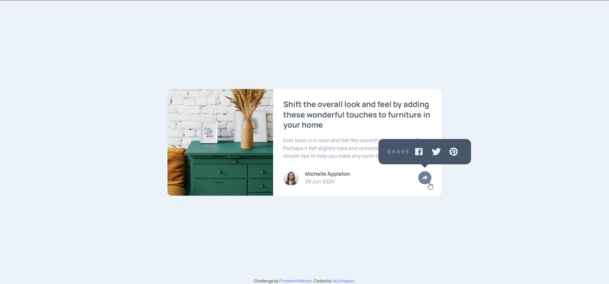
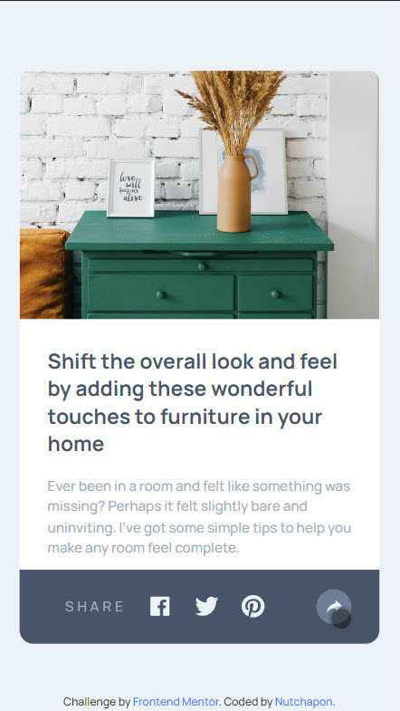

# Frontend Mentor - Article preview component solution (without JavaScript!)

This is a solution to the [Article preview component challenge on Frontend Mentor](https://www.frontendmentor.io/challenges/article-preview-component-dYBN_pYFT). Frontend Mentor challenges help you improve your coding skills by building realistic projects.

## Table of contents

- [Overview](#overview)
  - [The challenge](#the-challenge)
  - [Screenshot](#screenshot)
  - [Links](#links)
- [My process](#my-process)
  - [Built with](#built-with)
  - [What I learned](#what-i-learned)
  - [Useful resources](#useful-resources)
- [Author](#author)

## Overview

### The challenge

Users should be able to:

- View the optimal layout for the component depending on their device's screen size
- See the social media share links when they click the share icon

### Screenshot

### Links

- Solution URL: [Add solution URL here](https://your-solution-url.com)
- Live Site URL: [Add live site URL here](https://your-live-site-url.com)

## My process

### Built with

- Semantic HTML5 markup
- CSS custom properties
- Flexbox
- [React](https://reactjs.org/) - JS library
- [TailwindCSS](https://tailwindcss.com/) - CSS framework

### What I learned

Deep dive in Tailwind CSS specially in `<ShareBox>` Component
I using to so much Tailwind CSS with reponsive control (may be have better way to do that).

### Useful resources

- [Tailwind Documents](https://tailwindcss.com/docs/) - yah just a documents for telling me how to using Tailwind CSS.
- [Access to all child with Tailwind CSS](https://stackoverflow.com/questions/67119992/how-to-access-all-the-direct-children-of-a-div-in-tailwindcss) - definitely it has this command on documents of tailwind itself but lacking of use case.

## Author

- Github - [Nutchapon](https://github.com/kodaicoder)
- Twitter - [@SolanianNut](https://twitter.com/SolanianNut)
- Frontend Mentor - [@NutchaponMake](https://www.frontendmentor.io/profile/NutchaponMake)
